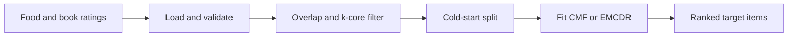
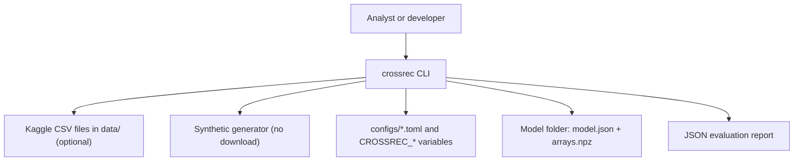
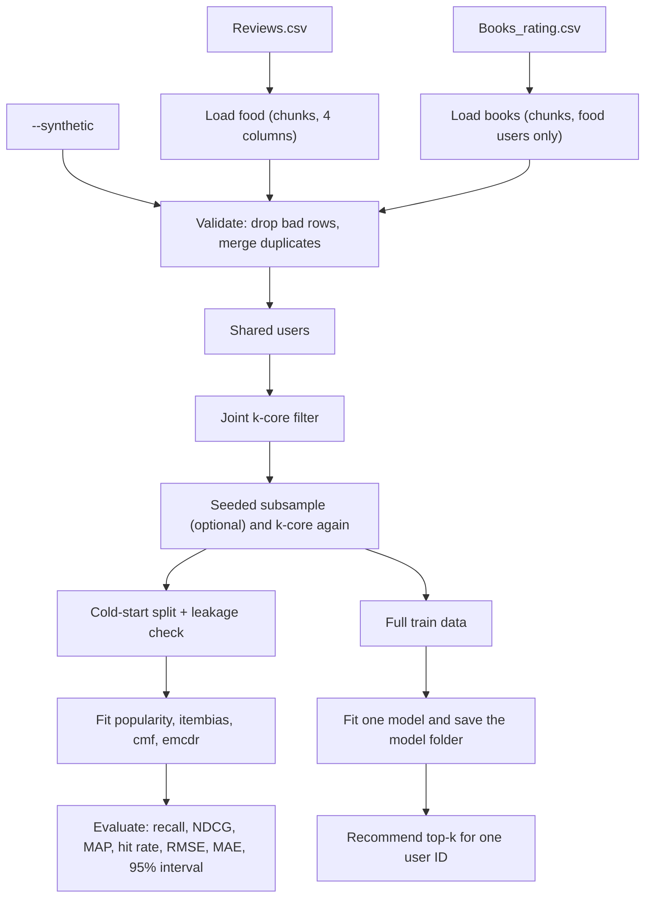

<div align="center">

# crossrec — Cross-Domain Recommendations from Food Tastes to Books and Back

**crossrec is a cold-start cross-domain recommender for users who rated products in one Amazon catalog. It takes food and book ratings through these steps to a ranked list of items from the other catalog:**

`load` → `validate` → `filter shared users` → `split` → `fit` → `evaluate` → `recommend`.


**[Summary](#1-summary)** ·
**[Workflow](#4-the-end-to-end-workflow)** ·
**[Run it](#14-how-to-run-crossrec)** ·
**[Configuration](#144-environment-variables)** ·
**[Known problems](#17-known-problems)** ·
**[Glossary](#19-glossary)**

</div>

> [!NOTE]
> This README uses ASD-STE100 Simplified Technical English. The writing rules and the project
> vocabulary are in [`docs/ste-style-guide.md`](docs/ste-style-guide.md). Each term in the
> [Glossary](#19-glossary) has only one meaning.

---

crossrec recommends books to a user from the food ratings of that user, and food items from the book ratings.
The user has no ratings in the target domain. This is the cold-start case.
The main idea is one shared latent space: CMF learns one user vector for both domains, and EMCDR learns a map between two latent spaces.
The code never multiplies vectors from two unrelated factorisations.
Each result comes from a seeded cold-start split, and two single-domain baselines give the reference level.

This README is the **one location that explains all of crossrec**. It gives these topics:

- the general design
- each component and its procedure, step by step
- the decision rules
- the data map
- the runbook
- the validation results and the known problems

| If you are… | Read |
|---|---|
| A manager or reviewer | [1](#1-summary), [3](#3-design-rules), [4](#4-the-end-to-end-workflow), [16](#16-validation-results), [18](#18-key-points) |
| A developer who joins the project | All sections, in sequence. Keep [14](#14-how-to-run-crossrec) and [17](#17-known-problems) open while you work |
| An operator who runs crossrec | [14](#14-how-to-run-crossrec), then the section for the component that you use |

---

## Table of contents

1. 🧭 [Summary](#1-summary)
2. 🏗️ [How crossrec is built](#2-how-crossrec-is-built)
   - 2.1 [Components](#21-components)
   - 2.2 [System context](#22-system-context)
   - 2.3 [Repository layout](#23-repository-layout)
3. 🛡️ [Design rules](#3-design-rules)
4. 🔄 [The end-to-end workflow](#4-the-end-to-end-workflow)
   - 4.1 [Full flow](#41-full-flow)
   - 4.2 [The life cycle of one recommendation](#42-the-life-cycle-of-one-recommendation)
5. 📥 [The data loaders](#5-the-data-loaders)
6. 🔵 [The overlap and the k-core filter](#6-the-overlap-and-the-k-core-filter)
7. ✂️ [The cold-start split](#7-the-cold-start-split)
8. 📊 [The baselines](#8-the-baselines)
9. 🟢 [The CMF model](#9-the-cmf-model)
10. 🟣 [The EMCDR model](#10-the-emcdr-model)
11. 🧪 [The evaluation protocol](#11-the-evaluation-protocol)
12. ⚖️ [The settings and decision rules](#12-the-settings-and-decision-rules)
13. 🗂️ [Data and file map](#13-data-and-file-map)
14. ▶️ [How to run crossrec](#14-how-to-run-crossrec)
    - 14.1 [Prerequisites](#141-prerequisites) · 14.2 [Installation](#142-installation) · 14.3 [Run crossrec](#143-run-crossrec) · 14.4 [Environment variables](#144-environment-variables)
15. 🧩 [How to extend crossrec](#15-how-to-extend-crossrec)
16. ✅ [Validation results](#16-validation-results)
17. ⚠️ [Known problems](#17-known-problems)
18. 📌 [Key points](#18-key-points)
19. 📖 [Glossary](#19-glossary)
20. 📄 [License](#20-license)

---

## 1. Summary

**The problem.** A user rated food items on Amazon and has no book ratings. Which books does this user like? These questions are difficult:

- How do you connect the taste in one domain to the items of a different domain?
- How do you keep enough shared users when the book file has 3 million rows?
- How do you treat a missing rating, which is not a 1-star rating?
- How do you prove that a cross-domain model is better than popularity?

crossrec gives each of these questions its own component. Each component has a unit test.

| Item | Value |
|---|---|
| Input | `Reviews.csv` (Fine Food) and `Books_rating.csv` (Books), or the built-in synthetic data |
| Output | A ranked list of target items for one user ID, a JSON evaluation report, a model folder |
| Components | **10** modules: config, schema, data, synthetic, overlap, split, models, metrics, evaluate, cli |
| Models | `popularity`, `itembias` (baselines), `cmf`, `emcdr` |
| Directions | `food` → `books` and `books` → `food` |
| Providers | None. All models run locally with NumPy |
| Offline mode | Everything. The synthetic data replaces the download |
| Safety | The split raises `LeakageError` if a held-out rating is in the train data |
| Tests | **41** unit tests (`pytest`). 1 test skips in CI because scikit-learn is optional |



---

## 2. How crossrec is built

### 2.1 Components

| Component | Module | Purpose |
|---|---|---|
| Settings | `src/crossrec/config.py` | `Settings` from defaults, environment variables, a TOML file and CLI flags |
| Rating schema | `src/crossrec/schema.py` | Canonical columns, row validation, duplicate merge, `ValidationReport` |
| Loaders | `src/crossrec/data.py` | Chunked CSV loaders, `CrossDomainData`, titles keyed by item ID |
| Synthetic data | `src/crossrec/synthetic.py` | Two domains with a known shared taste, CSV writer with the real column names |
| Overlap | `src/crossrec/overlap.py` | Shared users, joint k-core filter, seeded subsample |
| Split | `src/crossrec/split.py` | `cold_start_split`, `TrainData`, `LeakageError` |
| ALS core | `src/crossrec/models/als.py` | Biases, ALS on observed ratings, fold-in, `BiasedMF` |
| Model interface | `src/crossrec/models/base.py` | `Recommender`: fit, score, predict, recommend, save, restore |
| Baselines | `src/crossrec/models/baselines.py` | `PopularityRecommender`, `ItemBiasRecommender` |
| CMF | `src/crossrec/models/cmf.py` | `CMFRecommender`: one user vector for both domains |
| EMCDR | `src/crossrec/models/emcdr.py` | `EMCDRRecommender`: two MFs and a ridge or MLP map |
| Model registry | `src/crossrec/models/__init__.py` | `build(name, settings)` and `load(folder)` |
| Metrics | `src/crossrec/metrics.py` | Recall, NDCG, MAP, precision, hit rate, RMSE, MAE, bootstrap interval |
| Evaluation | `src/crossrec/evaluate.py` | The cold-start protocol and the result table |
| CLI | `src/crossrec/cli.py` | The `crossrec` command with 5 subcommands |

### 2.2 System context



### 2.3 Repository layout

```
crossrec/
├── .github/workflows/ci.yml     # CI: Python 3.11, pip install -e ".[dev]", pytest -q
├── .env.example                 # every CROSSREC_* variable, all values empty
├── pyproject.toml               # package, extras (mlp, dev), crossrec script
├── configs/
│   ├── default.toml             # the settings of the synthetic demo
│   └── full-data.toml           # a start point for the full public files (not tuned)
├── data/README.md               # sources, terms, columns and download steps
├── docs/ste-style-guide.md      # writing rules and project vocabulary
├── src/crossrec/
│   ├── config.py  schema.py  data.py      # settings, schema, loaders
│   ├── synthetic.py  overlap.py  split.py # synthetic data, k-core filter, cold-start split
│   ├── models/                            # als, base, baselines, cmf, emcdr, registry
│   ├── metrics.py  evaluate.py            # ranking and rating metrics, the protocol
│   └── cli.py                             # command line
└── tests/                                 # 41 tests, no network, no download
```

---

## 3. Design rules

### 3.1 One latent space for each prediction
Two independent factorisations have unrelated axes. Factor 3 of the food model has no relation to factor 3 of the book model. Thus the code never multiplies a food user vector with a book item vector from a different fit. CMF solves the books and the food against the same user vectors. EMCDR learns an explicit map from one space to the other.

### 3.2 Only observed ratings enter the fit
A missing rating is not a 0-star rating. `models/als.py` fits biases and factors only on the (user, item, rating) triples that exist. The fit never makes a dense matrix that has zeros in it.

### 3.3 The overlap comes first
`overlap.prepare` finds all shared users, applies the k-core filter and only then subsamples. The books loader reads the 2.9 GB file in chunks and keeps only users who rated food.

### 3.4 Items have stable IDs
Food items use `ProductId` and books use `Id` (the ASIN). A title is only a display label. Two editions or two different books with one title stay separate items.

### 3.5 The test users are true cold-start users
`cold_start_split` holds out all target ratings of each test user. `check_no_leakage` runs after each split and before each evaluation. The protocol scores test users through an unknown key, so a model must fold in the source history.

### 3.6 Recommendations use real user IDs and skip rated items
`crossrec recommend --user` takes the real Amazon user ID. The command removes all target items that the user rated before it ranks the rest.

### 3.7 Each run is reproducible
The split, the subsample, the ALS start values and the bootstrap use one seed. Model folders contain JSON and `.npz` files and load with `allow_pickle=False`.

---

## 4. The end-to-end workflow

### 4.1 Full flow



### 4.2 The life cycle of one recommendation

1. The loaders read the two CSV files and validate each row.
2. The overlap step keeps users with ratings in both domains.
3. The k-core filter removes users and items with too few ratings.
4. `crossrec train` fits one model on all filtered ratings and writes a model folder.
5. `crossrec recommend` loads the model folder and the ratings of the user.
6. The model gets the stored user vector, or folds in the source history for a new user.
7. The model scores all known target items.
8. The command removes the items that the user rated in the target domain.
9. The command prints the top-k item IDs with their titles and scores.

---

## 5. The data loaders

**Purpose.** Read the two public files into one canonical rating schema.

| Input | Output |
|---|---|
| `Reviews.csv`, `Books_rating.csv` | `CrossDomainData`: one rating frame for each domain, titles keyed by item ID, a `ValidationReport` for each domain |

| Raw file | Raw column | Canonical column |
|---|---|---|
| `Reviews.csv` | `UserId`, `ProductId`, `Score`, `Time` | `user_id`, `item_id`, `rating`, `timestamp` |
| `Books_rating.csv` | `User_id`, `Id`, `review/score`, `review/time`, `Title` | `user_id`, `item_id`, `rating`, `timestamp`, title map |

**Procedure**

1. Read the header. If a required column is missing, raise `SchemaError`.
2. Read only the used columns, in chunks of 200,000 rows.
3. For the books file, keep only the rows of users who rated food.
4. Keep the title of each book in a map from `Id` to `Title`.
5. Validate each chunk (see the rules).
6. Merge duplicate ratings again over the full domain, because a duplicate can cross a chunk border.

**Rules**

- A row with an empty user ID, an empty item ID or a rating that is not a number is dropped.
- A rating outside 1 to 5 is dropped.
- Two ratings of one user for one item become one rating: the mean rating and the latest time.
- The report counts each dropped row and each merged duplicate.

---

## 6. The overlap and the k-core filter

**Purpose.** Keep enough shared users, and keep only users and items with enough ratings.

| Input | Output |
|---|---|
| `CrossDomainData` | Filtered `CrossDomainData` and an `OverlapReport` |

**Procedure**

1. Count the users of each domain and the shared users.
2. Keep the users with at least `min_user_ratings` ratings in each domain.
3. In each domain, keep the items with at least `min_item_ratings` ratings.
4. Repeat steps 2 and 3 until no row changes (at most 100 rounds).
5. If `max_users` is more than 0, keep a seeded random subset of users. Then do steps 2 to 4 again.

**Rules**

- After the filter, each user has ratings in both domains.
- `crossrec stats` also prints the number of shared users after an independent 5% and 0.5% row sample. This number shows why the subsample comes last.

---

## 7. The cold-start split

**Purpose.** Make a test set in which each test user has no visible target rating.

| Input | Output |
|---|---|
| Filtered data, source domain, target domain, `test_fraction`, seed | `ColdStartSplit`: `TrainData`, held-out target ratings, train users, test users |

**Procedure**

1. List the shared users in sorted order.
2. Select `round(test_fraction × shared users)` test users with the seed.
3. Put all source ratings in the train data. The test users keep their source history.
4. Put the target ratings of the train users in the train data.
5. Put the target ratings of the test users in the held-out set.
6. Run `check_no_leakage`.

**Rules**

- `check_no_leakage` raises `LeakageError` if a test user has a target rating in the train data.
- The source and the target must be different domains.
- The split needs at least 2 shared users.

---

## 8. The baselines

**Purpose.** Give the reference level that a cross-domain model must beat. Neither baseline reads the source domain.

| Model | Score of a target item | Rating prediction |
|---|---|---|
| `popularity` | The count of train target ratings at or above `relevant_threshold`, plus 0.001 × all ratings as a tie-break | Global mean + item bias |
| `itembias` | Global mean + item bias (a regularised mean rating) | Global mean + item bias |

A target-only matrix factorisation has no user vector for a cold-start user. Its prediction for such a user is the `itembias` prediction. Thus `itembias` is also the single-domain MF baseline.

---

## 9. The CMF model

**Purpose.** Learn one user vector that explains the ratings of both domains.

| Input | Output |
|---|---|
| `TrainData` | User vectors, source item vectors, target item vectors, biases for each domain |

**Procedure**

1. Index all users of both domains in one index.
2. Fit the biases of each domain: global mean, user bias, item bias. Use 5 rounds of coordinate descent with a regularisation of 5.
3. Calculate the residual of each rating after the biases.
4. Put the source items and the target items in one item index. The source items come first.
5. Give each source residual the weight `source_weight` and each target residual the weight 1.
6. Run ALS for `iterations` rounds. Each round solves all user vectors, then all item vectors.
7. Score the target items: target mean + user target bias + item bias + user vector · item vector.

**Rules**

- The ridge penalty of a row is `reg × sum of its weights` (ALS-WR).
- A cold-start user gets a vector from the source ratings only (fold-in). Its target user bias is 0.
- A user with no known source item gets a zero vector. Its scores are the `itembias` scores.

---

## 10. The EMCDR model

**Purpose.** Keep two separate factorisations, and learn a map between their user spaces.

| Input | Output |
|---|---|
| `TrainData` | A source `BiasedMF`, a target `BiasedMF`, a map |

**Procedure**

1. Fit a biased MF on all source ratings.
2. Fit a biased MF on the train target ratings.
3. Find the bridge users: users in both MFs.
4. Learn the map from the source user vectors to the target user vectors of the bridge users.
5. For a cold-start user, get the source user vector (stored or folded in) and map it.
6. Score the target items with the mapped vector and the target item vectors.

**Rules**

- The default map is ridge regression with `map_reg = 1.0`. The intercept is not penalised.
- `mapping="mlp"` uses a scikit-learn `MLPRegressor` with one hidden layer of `2 × factors` units. It needs the `mlp` extra.
- `save()` supports only the linear map.
- EMCDR needs at least 2 bridge users.

---

## 11. The evaluation protocol

**Purpose.** Measure how well each model ranks and rates the target items of cold-start users.

| Input | Output |
|---|---|
| A fitted model, a `ColdStartSplit`, `k`, `relevant_threshold`, seed | `ModelResult`: mean metrics, 95% bootstrap intervals, RMSE, MAE, counts |

**Procedure**

1. Run `check_no_leakage`.
2. For each test user, get the source history from the train data.
3. Predict a rating for each held-out item. Collect them for RMSE and MAE.
4. Find the relevant items: held-out items with a rating at or above `relevant_threshold`.
5. If the user has no relevant item, count the user in `users_without_relevant` and continue.
6. Rank all known target items for the user with an unknown key and the source history.
7. Calculate recall@k, NDCG@k, MAP@k, precision@k and hit rate@k.
8. Calculate the mean of each metric and a 95% percentile bootstrap interval (1,000 samples).

**Rules**

- Recall@k divides by `min(relevant items, k)`.
- A relevant item that no train user rated cannot be ranked. The report counts it in `unreachable_relevant`.
- An item that the model does not know gets the target mean as its rating prediction.
- Predictions are clipped to 1 to 5.

---

## 12. The settings and decision rules

| Setting | Default | Rule |
|---|---|---|
| `seed` | 42 | Split, subsample, ALS start values, bootstrap |
| `factors` | 8 | At least 1 |
| `reg` | 0.1 | At least 0. Multiplied by the weight sum of each row |
| `iterations` | 12 | ALS rounds |
| `source_weight` | 1.0 | Weight of the source ratings in CMF |
| `min_user_ratings` | 3 | Minimum ratings of a user in each domain |
| `min_item_ratings` | 3 | Minimum ratings of an item |
| `max_users` | 0 | 0 keeps all shared users |
| `test_fraction` | 0.2 | More than 0 and less than 1 |
| `k` | 10 | Length of the ranked list |
| `relevant_threshold` | 4.0 | A held-out rating at or above this value is relevant |

| Fixed value | Value | Module |
|---|---|---|
| Valid rating range | 1 to 5 | `schema.py` |
| Bias regularisation (user and item) | 5.0 | `models/als.py` |
| Bias rounds | 5 | `models/als.py` |
| Start values of the vectors | Normal, standard deviation 0.1 | `models/als.py` |
| EMCDR map regularisation | 1.0 | `models/emcdr.py` |
| Bootstrap samples | 1,000 | `metrics.py` |
| Loader chunk size | 200,000 rows | `data.py` |

---

## 13. Data and file map

| Path | Committed? | Contents |
|---|---|---|
| `data/README.md` | Yes | Sources, terms, columns, download steps |
| `data/Reviews.csv`, `data/Books_rating.csv` | No (git ignores them) | The public review files |
| `data/synthetic/` | No (git ignores it) | Output of `crossrec synth` |
| `configs/default.toml`, `configs/full-data.toml` | Yes | Experiment settings |
| `models/<name>/model.json`, `arrays.npz` | No (git ignores them) | Output of `crossrec train` |
| `reports/*.json` | No (git ignores them) | Output of `crossrec evaluate --out` |
| `.env.example` | Yes | All 12 `CROSSREC_*` variables, empty |
| `.env` | No (git ignores it) | Local settings |

---

## 14. How to run crossrec

### 14.1 Prerequisites

| Need | For |
|---|---|
| Python 3.11+ | All components |
| `numpy>=1.24`, `pandas>=2.0` | All components (installed with the package) |
| `scikit-learn>=1.3` (extra `mlp`) | The MLP map of EMCDR only |
| About 8 GB RAM | The full books file (the loader reads it in chunks) |

### 14.2 Installation

```bash
git clone https://github.com/KrishnaAnnavaram/crossrec.git
cd crossrec
python -m venv .venv
. .venv/bin/activate            # Windows: .venv\Scripts\activate
pip install -e ".[dev]"         # add ,mlp for the MLP map
```

### 14.3 Run crossrec

Offline (no download):

```bash
crossrec evaluate --synthetic                                   # food -> books, all 4 models
crossrec evaluate --synthetic --source books --target food
crossrec synth --out data/synthetic                             # CSV files with the real column names
crossrec stats --data-dir data/synthetic
crossrec train --data-dir data/synthetic --model cmf --out models/cmf
crossrec recommend --data-dir data/synthetic --model-dir models/cmf --user U00003 --k 5
```

With the public files (see `data/README.md`):

```bash
crossrec stats --data-dir data
crossrec evaluate --config configs/full-data.toml --out reports/food2books.json
crossrec train --config configs/full-data.toml --model emcdr --out models/emcdr
crossrec recommend --data-dir data --model-dir models/emcdr --user A3SGXH7AUHU8GW
```

### 14.4 Environment variables

| Variable | Used by | Meaning |
|---|---|---|
| `CROSSREC_DATA_DIR` | Loaders | Folder with the two CSV files. Default `data` |
| `CROSSREC_SEED` | Split, models, bootstrap | Seed. Default 42 |
| `CROSSREC_FACTORS` | CMF, EMCDR | Vector length. Default 8 |
| `CROSSREC_REG` | CMF, EMCDR | ALS regularisation. Default 0.1 |
| `CROSSREC_ITERATIONS` | CMF, EMCDR | ALS rounds. Default 12 |
| `CROSSREC_SOURCE_WEIGHT` | CMF | Weight of source ratings. Default 1.0 |
| `CROSSREC_MIN_USER_RATINGS` | k-core filter | Default 3 |
| `CROSSREC_MIN_ITEM_RATINGS` | k-core filter | Default 3 |
| `CROSSREC_MAX_USERS` | Subsample | Default 0 (all users) |
| `CROSSREC_TEST_FRACTION` | Split | Default 0.2 |
| `CROSSREC_K` | Evaluation, recommend | List length. Default 10 |
| `CROSSREC_RELEVANT_THRESHOLD` | Evaluation, popularity | Default 4.0 |

The order of precedence is: CLI flag, TOML file (`--config`), environment variable, default.
crossrec uses no credentials. Keep local values in `.env`. Git ignores this file.

---

## 15. How to extend crossrec

| You want to… | Do this | Code change? |
|---|---|---|
| Change the vector length or the filter | Edit a TOML file or set a `CROSSREC_*` variable | No |
| Use the MLP map | `pip install -e ".[mlp]"`, then `build("emcdr", settings, mapping="mlp")` | No |
| Add a third domain (for example movies) | Add a column map and a loader call in `data.py`, and add the name to `DOMAINS` | Small |
| Add a model | Subclass `Recommender`, implement `_fit` and `score_target`, add it to `MODELS` | Small |
| Add a neural two-tower model | Put it in a new module that imports torch lazily, and add a `torch` extra | Yes |
| Add implicit feedback | Replace the residual target with a 0/1 preference and confidence weights in `als.py` | Yes |

---

## 16. Validation results

| Validation | Result | Command |
|---|---|---|
| Unit tests | **41 passed** (local). CI without scikit-learn: 40 passed, 1 skipped | `pytest -q` |
| Synthetic, food → books, 84 cold-start users | See the first table below | `crossrec evaluate --synthetic` |
| Synthetic, books → food, 84 cold-start users | See the second table below | `crossrec evaluate --synthetic --source books --target food` |
| Old sample-then-intersect, synthetic | 24 shared users kept out of 420 | `crossrec stats --synthetic` |

Synthetic data, seed 42, 420 shared users after the k-core filter, k = 10:

| Model (food → books) | Recall@10 | NDCG@10 | NDCG 95% interval | MAP@10 | Hit@10 | RMSE | MAE |
|---|---|---|---|---|---|---|---|
| `popularity` | 0.123 | 0.137 | [0.112, 0.164] | 0.055 | 0.762 | 0.841 | 0.677 |
| `itembias` | 0.103 | 0.099 | [0.078, 0.120] | 0.035 | 0.643 | 0.841 | 0.677 |
| `cmf` | **0.183** | **0.198** | [0.163, 0.229] | **0.090** | 0.845 | **0.759** | **0.595** |
| `emcdr` | 0.181 | 0.193 | [0.163, 0.224] | 0.085 | **0.929** | 0.768 | 0.614 |

| Model (books → food) | Recall@10 | NDCG@10 | NDCG 95% interval | MAP@10 | Hit@10 | RMSE | MAE |
|---|---|---|---|---|---|---|---|
| `popularity` | 0.173 | 0.171 | [0.148, 0.194] | 0.068 | 0.869 | 0.894 | 0.709 |
| `itembias` | 0.121 | 0.118 | [0.091, 0.145] | 0.047 | 0.643 | 0.894 | 0.709 |
| `cmf` | **0.239** | **0.236** | [0.206, 0.271] | **0.111** | **0.941** | **0.786** | **0.610** |
| `emcdr` | 0.207 | 0.218 | [0.182, 0.255] | 0.104 | 0.833 | 0.798 | 0.626 |

These numbers are from SYNTHETIC data. In the synthetic data, one taste vector drives the ratings of both domains. Thus the numbers prove that the transfer code works and that the split has no leakage. They do not prove that food taste predicts book taste on Amazon.
A test also shuffles the source ratings. Then the CMF advantage goes away, so the gain comes from the source history.
The prototype reported no metric. This project has no result on the real files yet.

---

## 17. Known problems

Read these problems before you use crossrec in production.

| # | Area | Problem | Impact and action |
|---|---|---|---|
| 1 | Results | No result on the real public files is in this README. CI uses only synthetic data | Run `crossrec evaluate` on the real files and report the numbers with the seed |
| 2 | Overlap | The real overlap of Fine Food and Books users is not measured here. It can be small | Run `crossrec stats --data-dir data` first. A small overlap gives wide intervals |
| 3 | Exposure | The models rank by a predicted rating. They do not model which items a user sees | When the synthetic popularity skew is strong, `popularity` wins the ranking metrics. Compare with the baselines on each dataset |
| 4 | Scale | The ALS solver loops over users and items in Python | It is fast for thousands of users. For millions, use a compiled ALS library |
| 5 | Tuning | `configs/full-data.toml` is not tuned. There is no validation split for tuning | Tune on a separate validation split, not on the test users |
| 6 | Food titles | `Reviews.csv` has no product name. Food items show their `ProductId` | Join a product catalog for display names |
| 7 | Bias | Amazon reviewers are not a random sample of readers or buyers | Do not use the lists to make decisions about people |
| 8 | MLP map | `save()` supports only the linear EMCDR map | Use the linear map for saved models |

---

## 18. Key points

1. **One latent space for each prediction.** CMF shares the user vectors. EMCDR learns a map. No code multiplies vectors from two unrelated fits.
2. **A missing rating is not a zero.** The ALS fit uses only observed ratings, with biases for each domain.
3. **The overlap comes first.** The k-core filter runs on all shared users, and the subsample comes after it.
4. **Each result is a cold-start result.** The split holds out all target ratings of each test user, and a leakage check runs each time.
5. **Two baselines give the reference level.** On the synthetic data, CMF gets NDCG@10 0.198 against 0.137 for popularity.
6. **The full demo runs offline.** All 41 tests use synthetic data and need no download.

---

## 19. Glossary

| Term | Meaning |
|---|---|
| **ALS** | Alternating least squares: solve all user vectors, then all item vectors, and repeat |
| **Baseline** | `popularity` or `itembias`. Neither reads the source domain |
| **Bias** | The global mean, user offset or item offset of a domain |
| **CMF** | Collective matrix factorisation with one user vector for both domains |
| **Cold-start user** | A test user whose target ratings are all held out |
| **Domain** | One review catalog: `food` or `books` |
| **EMCDR** | Embedding and mapping: two MFs plus a map between their user spaces |
| **Fold-in** | Solve the user vector of a new user from its ratings, with fixed item vectors |
| **Held-out rating** | A target rating of a test user that no model sees at fit time |
| **Item ID** | `ProductId` for food and `Id` (ASIN) for books |
| **k-core filter** | The filter that keeps users and items with a minimum number of ratings |
| **Map** | The learned function from source user vectors to target user vectors |
| **NDCG@k** | Normalised discounted cumulative gain of the top-k list |
| **Rating** | A star value from 1 to 5 |
| **Relevant item** | A held-out item with a rating at or above the relevance threshold |
| **Score** | The number that a model gives an item to rank it |
| **Shared user** | A user with ratings in both domains |
| **Source domain** | The domain that the model reads for a test user |
| **Target domain** | The domain that the model recommends from |

---

## 20. License

[MIT](LICENSE) © 2026 Krishna Annavaram
